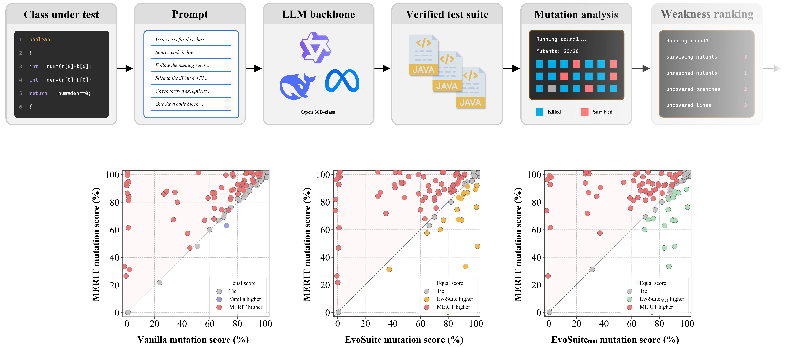

<h1> 
  <p align=center> MERIT: Mutation-Exposed Weakness Ranking for Iterative Testing With Open-Source Code Large Language Models </p>
<div align="center">


[](README.md)

</div>
</h1>



## DataSet  
<table>
  <thead align="center">
    <tr>
      <th>Database</th>
      <th>Description</th>
      <th>Subjects</th>
      <th>Mutants</th>
      <th>Perturbed Subjects</th>
      <th>BaiduYun Download</th>
      <th>Google Download</th>
    </tr>
  </thead>
  <tbody align="center">
    <tr>
      <td><a href="https://github.com/lin-tan/clm">HumanEval-Java</a></td>
      <td align="left">Method-level Java subjects taken verbatim from the official index of the program-repair dataset. Each subject is a self-contained algorithmic class.</td>
      <td>104</td>
      <td>1,114</td>
      <td>50</td>
      <td>---</td>
      <td>---</td>
    </tr>
    <tr>
      <td>LeetCode-Java</td>
      <td align="left">Rebuilt under the MUTGEN protocol from a public corpus of LeetCode solutions. 50 Medium and 50 Hard problems drawn with a fixed seed, each verified to compile in isolation.</td>
      <td>100</td>
      <td>1,829</td>
      <td>50</td>
      <td>---</td>
      <td>---</td>
    </tr>
  </tbody>
</table>

## Model Zoo  

<table>
  <thead align="center">
    <tr>
      <th>Backbone</th>
      <th>Benchmark</th>
      <th>Rounds</th>
      <th>Params(B)</th>
      <th>Tokens</th>
      <th>$MS$</th>
      <th>$Line$</th>
      <th>$Branch$</th>
      <th>BaiduYun Download</th>
      <th>Google Download</th>
    </tr>
  </thead>
  <tbody align="center">
    <tr>
      <td>MERIT-Qwen2.5-Coder</td>
      <td>HumanEval-Java</td>
      <td>4</td>
      <td>32</td>
      <td>3,698</td>
      <td>88.8</td>
      <td>85.0</td>
      <td>93.2</td>
      <td>---</td>
      <td>---</td>
    </tr>
    <tr>
      <td>MERIT-Qwen2.5-Coder</td>
      <td>LeetCode-Java</td>
      <td>4</td>
      <td>32</td>
      <td>6,036</td>
      <td>84.3</td>
      <td>93.9</td>
      <td>90.2</td>
      <td>---</td>
      <td>---</td>
    </tr>
    <tr>
      <td>MERIT-DeepSeek-Coder</td>
      <td>HumanEval-Java</td>
      <td>4</td>
      <td>33</td>
      <td>3,616</td>
      <td>69.7</td>
      <td>68.0</td>
      <td>74.1</td>
      <td>---</td>
      <td>---</td>
    </tr>
    <tr>
      <td>MERIT-DeepSeek-Coder</td>
      <td>LeetCode-Java</td>
      <td>4</td>
      <td>33</td>
      <td>3,784</td>
      <td>34.3</td>
      <td>40.2</td>
      <td>38.2</td>
      <td>---</td>
      <td>---</td>
    </tr>
    <tr>
      <td>MERIT-CodeLlama</td>
      <td>HumanEval-Java</td>
      <td>4</td>
      <td>34</td>
      <td>4,337</td>
      <td>33.8</td>
      <td>32.0</td>
      <td>34.7</td>
      <td>---</td>
      <td>---</td>
    </tr>
    <tr>
      <td>MERIT-CodeLlama</td>
      <td>LeetCode-Java</td>
      <td>4</td>
      <td>34</td>
      <td>5,798</td>
      <td>23.0</td>
      <td>31.8</td>
      <td>30.0</td>
      <td>---</td>
      <td>---</td>
    </tr>
  </tbody>
</table>

- Results of the mutation score are evaluated with PIT 1.15.3 under its DEFAULTS operator group, averaged over the subjects of each benchmark.
- All backbones are served locally without fine-tuning, at temperature 0 with at most 1400 new tokens per call.


## Dependencies and Installation 

1. Clone and enter the repo.

   ```shell
   git clone https://github.com/wanq501/MERIT.git
   cd MERIT
   ```

2. Install dependencies

   ```shell
   pip install -e .
   ```

- Note: JDK 11 and Maven must be on PATH to match the EvoSuite runtime. JUnit 4.13.2, JaCoCo 0.8.11, PIT 1.15.3, and EvoSuite 1.2.0 are pinned in the build files and resolved on the first run.

## Generation and Evaluation 

1. Serving

   ```shell
   python tools/serve.py
   ```


2. Generation

   ```shell
   python tools/generate.py
   ```


3. Evaluation

   ```shell
   python tools/eval.py
   ```

4. Ablation

   ```shell
   python tools/ablate.py
   ```

- Note: Each script includes detailed instructions on how to set parameters and use the script properly.


## Code  
The code will be made public shortly after the acceptance of the paper.


## Citation

If you find our repo useful for your research, please cite us:

```


```

This project is based on the open source mutation testing tool [PIT (Pitest)](https://github.com/hcoles/pitest).

```
@inproceedings{PIT,
  author={Henry Coles and Thomas Laurent and Christopher Henard and Mike Papadakis and Anthony Ventresque},
  title={PIT: a practical mutation testing tool for Java},
  booktitle={Proceedings of the 25th International Symposium on Software Testing and Analysis},
  pages={449--452},
  year={2016}
}
```


This project also utilizes the [HumanEval-Java](https://github.com/lin-tan/clm) dataset for evaluation.

```
@inproceedings{HumanEval-Java,
  title={Impact of Code Language Models on Automated Program Repair},
  author={Nan Jiang and Kevin Liu and Thibaud Lutellier and Lin Tan},
  booktitle={Proceedings of the 45th International Conference on Software Engineering},
  pages={1430--1442},
  year={2023}
}
```
